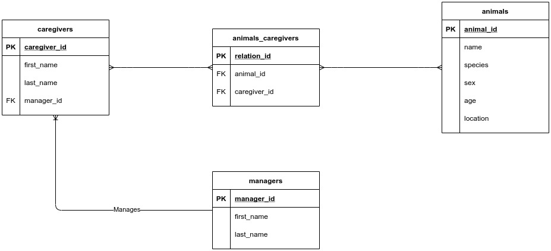

# DIA 21.1 :rocket:

O objetivo dos exercícios desse dia foi colocar em prática o que havia aprendido sobre como modelar e criar base de dados e tabelas SQL.

Os requisitos do exercício são:

1. Um zoológico precisa de um banco de dados para armazenar informações sobre os seus animais. As informações a serem armazenadas sobre cada animal são:

  * Nome;
  * Espécie;
  * Sexo;
  * Idade;
  * Localização.

Cada animal também possui vários cuidadores, e cada cuidador pode ser responsável por mais de um animal. Além disso, cada cuidador possui um gerente, sendo que cada gerente pode ser responsável por mais de um cuidador.
Siga os passos aprendidos no dia de hoje para modelar essa base de dados.

### Resolução

Eu comecei planejando o banco de dados e seus relacionamentos como mostrado na imagem abaixo:



Depois disso escrevi os comandos para a criação da base de dados e das tabelas, não populei pois não foi nos dado dados para popular as tabelas.

```sql
-- Criando a base de dados
CREATE DATABASE IF NOT EXISTS zoo;

-- Criando as tabelas
CREATE TABLE managers(
       manager_id INT NOT NULL AUTO_INCREMENT PRIMARY KEY,
       first_name VARCHAR(30) NOT NULL,
       last_name VARCHAR(10) NOT NULL,
       populacao INTEGER
    );

CREATE TABLE caregivers(
       caregiver_id INT NOT NULL AUTO_INCREMENT PRIMARY KEY,
       first_name VARCHAR(30) NOT NULL,
       last_name VARCHAR(10) NOT NULL,
       manager_id INTEGER
       FOREIGN KEY (manager_id) REFERENCES managers (manager_id)
    );

CREATE TABLE caregivers(
       caregiver_id INT NOT NULL AUTO_INCREMENT PRIMARY KEY,
       first_name VARCHAR(30) NOT NULL,
       last_name VARCHAR(10) NOT NULL,
       manager_id INTEGER
       FOREIGN KEY (manager_id) REFERENCES managers (manager_id)
    );

CREATE TABLE animals(
       animal_id INT NOT NULL AUTO_INCREMENT PRIMARY KEY,
       `name` VARCHAR(30) NOT NULL,
       species VARCHAR(30) NOT NULL,
       sex VARCHAR(10) NOT NULL,
       age INTEGER(),
       location VARCHAR(50)
    );

CREATE TABLE animals_caregivers(
      relation_id INT NOT NULL AUTO_INCREMENT PRIMARY KEY,
      animal_id INT,
      caregiver_id INT,
      FOREIGN KEY (animal_id) REFERENCES animals(animal_id),
      FOREIGN KEY (caregiver_id) REFERENCES caregivers(caregiver_id)
);

```