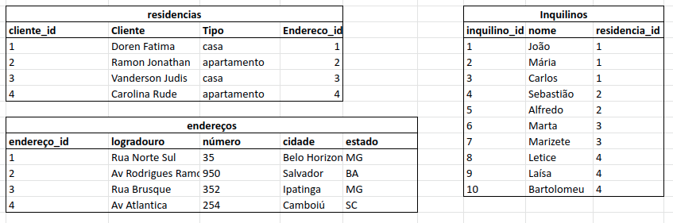
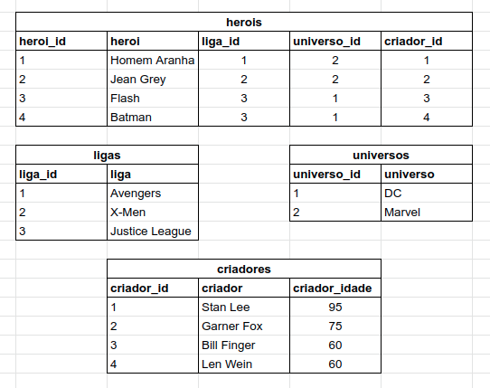
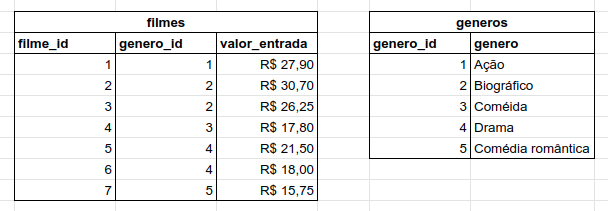

# DIA 22.2 :rocket:

O objetivo dos exercícios desse dia foi colocar em prática o que havia aprendido sobre normalização de banco de dados e tabelas SQL.

Os requisitos do exercício são:

### Exercício 1: 
* Converta a tabela desnormalizada abaixo para a 1ª Forma Normal.

    

    Minha resolução:
    

### Exercício 2: 
* Converta a tabela desnormalizada abaixo (que já está nos padrões da 1ª Forma Normal) para a 2ª Forma Normal.

    Minha resolução:
    

### Exercício 3: 
* Agora, converta essa outra tabela (que já está nos moldes das duas primeiras formas) para a 3ª Forma Normal.

    Minha resolução:
    

